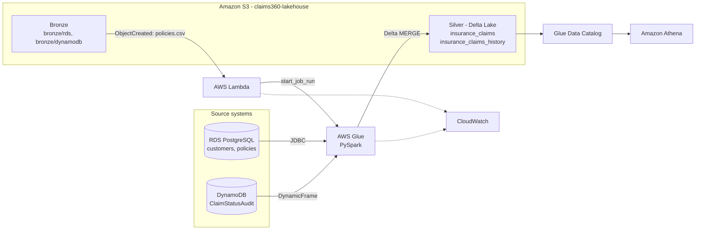

<div align="center">

# Claims 360 — Insurance Claims Data Lakehouse on AWS

**A batch lakehouse that merges RDS PostgreSQL and DynamoDB claim data into Delta Lake tables on S3, queried with Athena.**


[Overview](#overview) · [Architecture](#architecture) · [ETL](#etl-pipeline) · [Delta Lake](#delta-lake) · [Athena](#athena-analytics) · [Setup](#setup) · [Security](#security)

</div>

---

## Overview

Claims 360 is an AWS Data Engineering capstone **proof of concept**. It consolidates structured data (customers, policies in **Amazon RDS PostgreSQL**) and semi-structured data (claim status audit log in **Amazon DynamoDB**) into a lakehouse on **S3** using **AWS Glue (PySpark)** and **Delta Lake**. A Lambda function starts the pipeline when a batch lands in S3, and analysts query the result with **Amazon Athena**.

| | |
|---|---|
| **Pattern** | Batch ETL, event-triggered, Bronze → Silver |
| **Data** | Synthetic: 50 customers, 50 policies, 100 claim audit entries |
| **Core skills shown** | Multi-source ingestion, PySpark transforms, deduplication, schema evolution, Delta MERGE, event-driven orchestration, Athena over Delta |
| **Scope** | POC / capstone. Not a production deployment |

> **Legend used across the repo:** `[IMPLEMENTED]` built in the POC · `[DOCUMENTATION]` explains it · `[RECOMMENDED]` suggested improvement · `[FUTURE]` not built.

## Business Problem

Insurance data is usually split across systems: policies in relational databases, claim activity in NoSQL audit logs. That causes:

- no single place for analytics and no easy view of a claim's full lifecycle,
- manual reconciliation between systems and inconsistent data after updates,
- pipelines that break when a source schema changes.

**Goal:** show the *latest state* of every claim while keeping the *complete history* of its updates.

## Architecture



Full diagrams: [architecture](diagrams/architecture.md) · [data flow](diagrams/data-flow.md). Design notes: [docs/architecture.md](docs/architecture.md).

> Only implemented services appear above. Kinesis, SageMaker, Step Functions, DataBrew, QuickSight, DynamoDB Streams and CodePipeline are [future work](#future-enhancements).

## Data Sources

| Source | Store | Content |
|---|---|---|
| Amazon RDS PostgreSQL (`insurance-db`) | tables `customers`, `policies` | Customer risk segment, policy type and premium |
| Amazon DynamoDB | table `ClaimStatusAudit` (PK `claim_id`, SK `updated_at`) | One item per claim status change: `status`, `amount`, later `adjuster_note` |

Schemas and relationships: [docs/data-model.md](docs/data-model.md). Sample data generator: [`src/data_generation/generate_dataset.py`](src/data_generation/generate_dataset.py).

## Data Lake Structure

```text
s3://claims360-lakehouse/
├── bronze/                      # raw incoming source files
│   ├── dynamodb/claims_audit.json
│   └── rds/{customers.csv, policies.csv}
└── silver/
    ├── Claims-360-athena/       # Athena query results
    └── delta/
        ├── insurance_claims/          # current state (Delta)
        └── insurance_claims_history/  # historical records (Delta)
```

There is no Gold layer in this POC.

## ETL Pipeline

`Claims360-Job` (Glue 4.0, G.1X, PySpark) — code in [`src/etl/claims360_glue_job.py`](src/etl/claims360_glue_job.py).

1. **Extract** — customers and policies from RDS via JDBC; claims from DynamoDB via Glue DynamicFrame.
2. **Transform** — normalize, evolve schema, cast types, derive keys, join, deduplicate.
3. **Load** — initial Delta write, then `MERGE` on later runs.

## Data Transformation

| Step | What happens |
|---|---|
| Normalization | Claim column names lowercased; `amount` → `amount_claimed` |
| Types | `updated_at` → timestamp, `amount_claimed` → double |
| Schema evolution | `adjuster_note` added as `null` if the source lacks it |
| Derived keys | `derived_cust_id`, `derived_policy_id` computed from the number in `claim_id` |
| Joins | claims ⟕ policies ⟕ customers (left joins) |
| Deduplication | `row_number()` over `Window.partitionBy("claim_id").orderBy(updated_at desc)`; keep row 1 |

<details>
<summary><b>Note on derived keys (POC only)</b></summary>

The synthetic claim records contain no customer or policy reference, so the job derives them from the numeric part of `claim_id` (`n % 50 + 1`). This makes the three datasets joinable for the demo. It is **not** a recommended real-world modeling approach; real claims would carry the policy reference from the source system.
</details>

## Delta Lake

- **MERGE (upsert)** — `existing.claim_id = incoming.claim_id`, `whenMatchedUpdateAll()` + `whenNotMatchedInsertAll()` keeps `insurance_claims` at the latest state.
- **Current vs. historical state** — `insurance_claims` holds one row per claim; `insurance_claims_history` is the history table documented in the report. The report does not include the history-write code, so it is not reproduced here.
- **Transaction log** — each commit is a JSON file in `_delta_log/`. This supports ACID guarantees, auditability and versioned (time-travel) reads.
- **Schema evolution** — `mergeSchema=true` on the initial write and `spark.databricks.delta.schema.autoMerge.enabled=true` allow the new `adjuster_note` column. This shows one column-addition case, not full schema governance.

| ACID property | How (per the report) |
|---|---|
| Atomicity | Failed job leaves the table at its last consistent version |
| Consistency | Schema and types stay valid after each write |
| Isolation | Optimistic concurrency control |
| Durability | Committed data stored in S3, referenced by immutable log entries |

More: [docs/pipeline.md](docs/pipeline.md).

## Event-Driven Processing

```text
S3 (bronze/rds/policies.csv, ObjectCreated:Put) → Lambda triggers-glue-job-1 → glue.start_job_run() → Claims360-Job
```

Uploading `policies.csv` is treated as "the batch is ready". Code: [`src/lambda/trigger_glue_job.py`](src/lambda/trigger_glue_job.py). The Glue job reads RDS and DynamoDB directly; the Bronze upload is the trigger and raw landing copy.

## Athena Analytics

The Delta table is registered in the Glue Data Catalog and queried with Athena:

```sql
CREATE EXTERNAL TABLE claims_table_v2
LOCATION 's3://claims360-lakehouse/silver/delta/'
TBLPROPERTIES ('table_type' = 'DELTA');
```

Business query — **total paid claims per risk segment**:

```sql
SELECT risk_segment,
       SUM(amount)     AS total_paid_claims,
       COUNT(claim_id) AS claim_count
FROM claims_table_v2
WHERE status = 'Paid'
GROUP BY risk_segment;
```

All queries: [`sql/athena/`](sql/athena).

## Project Results

The POC demonstrated:

- ingestion from a relational and a NoSQL source into one Delta table,
- one current row per claim while repeated audit entries are handled,
- a new source column (`adjuster_note`) flowing through to Athena without breaking queries,
- ACID-backed upserts and a versioned `_delta_log/`,
- an S3 → Lambda → Glue automated trigger.

Stated project benefits: centralized analytics, historical tracking, better decision support, serverless scalability, pay-as-you-go cost, faster querying with Athena, data reliability. These are design outcomes; no performance benchmarks were run.

## Challenges & Solutions

| Challenge | Resolution |
|---|---|
| Joining relational and NoSQL data | Glue DynamicFrames + Spark joins |
| Repeated claim IDs | Window function to keep the latest record |
| Source schema changes | Runtime missing-column handling + Delta `mergeSchema` |
| ACID-compliant writes | Delta transaction log and MERGE |
| Historical claim querying | History table + Athena / Delta capabilities |
| Pipeline automation | S3 event → Lambda → Glue |

Details: [docs/challenges-and-resolutions.md](docs/challenges-and-resolutions.md).

## AWS Services

| Service | Use |
|---|---|
| Amazon S3 | Bronze / Silver storage |
| Amazon RDS (PostgreSQL) | Customers and policies |
| Amazon DynamoDB | Claim status audit log |
| AWS Glue (PySpark) | ETL |
| AWS Lambda | Pipeline trigger |
| Delta Lake | ACID lakehouse table format |
| AWS Glue Data Catalog | Table metadata |
| Amazon Athena | SQL analytics |
| AWS IAM | Roles for Glue and Lambda |
| Amazon CloudWatch | Logs and monitoring |

## Future Enhancements

> **NOT IMPLEMENTED IN THIS POC.** Listed in the report as next-phase work: Amazon Kinesis (streaming), Amazon SageMaker (fraud detection), AWS Step Functions (orchestration), AWS Glue DataBrew (data quality), Amazon QuickSight (dashboards), DynamoDB Streams (CDC), AWS CodePipeline (CI/CD). See [docs/future-enhancements.md](docs/future-enhancements.md).

## Repository Structure

```text
claims-360-insurance-lakehouse/
├── README.md
├── LICENSE
├── SECURITY.md
├── .gitignore
├── .env.example
├── requirements.txt
├── src/
│   ├── data_generation/generate_dataset.py   # sample data generator
│   ├── etl/claims360_glue_job.py             # Glue PySpark job
│   └── lambda/trigger_glue_job.py            # S3 -> Glue trigger
├── data/                                     # sample data notes (files are generated)
├── sql/
│   ├── rds/          # create_tables, load_data, verify_data
│   └── athena/       # create_delta_table, business, time travel, schema evolution
├── infrastructure/   # per-service configuration notes (iam, s3, rds, dynamodb, glue, lambda)
├── docs/             # architecture, data model, pipeline, lineage, challenges, testing, future work
├── diagrams/         # Mermaid architecture and data flow
├── screenshots/      # sanitized AWS console screenshots
└── reports/          # sanitized project report
```

## Setup

High-level steps to reproduce the POC in your own AWS account (resources were created manually, without IaC):

1. Generate data: `python src/data_generation/generate_dataset.py`.
2. Create the S3 bucket with the Bronze/Silver layout ([S3 notes](infrastructure/s3/README.md)).
3. Create RDS PostgreSQL, then run [`sql/rds/`](sql/rds) scripts through CloudShell ([RDS notes](infrastructure/rds/README.md)).
4. Create the DynamoDB table `ClaimStatusAudit` and load `claims_audit.json` ([notes](infrastructure/dynamodb/README.md)).
5. Create IAM roles ([notes](infrastructure/iam/README.md)).
6. Create the Glue job with the script and job parameters ([notes](infrastructure/glue/README.md)).
7. Create the Lambda function and S3 event notification ([notes](infrastructure/lambda/README.md)).
8. Upload `customers.csv` and `claims_audit.json`, then `policies.csv` last to start the pipeline.
9. Register the Delta table and query it with [`sql/athena/`](sql/athena).

Copy `.env.example` to `.env` for local values. Dependencies: [`requirements.txt`](requirements.txt) (local packages vs. Glue-provided runtime).

## Recommended Testing

No automated tests were implemented. Suggested checks are in [docs/recommended-testing.md](docs/recommended-testing.md) `[RECOMMENDED]`.

## Security

- No credentials are stored in this repository; the original hardcoded database password was replaced with Glue job parameters.
- Use IAM roles for service access and Secrets Manager beyond the POC.
- The POC IAM policies are broad and the RDS security group was open; both are documented as POC shortcuts, not production practice.

Details: [SECURITY.md](SECURITY.md).

## Project Report

Full capstone report (sanitized): [`reports/project-report.pdf`](reports/project-report.pdf).

## License

[MIT](LICENSE)
