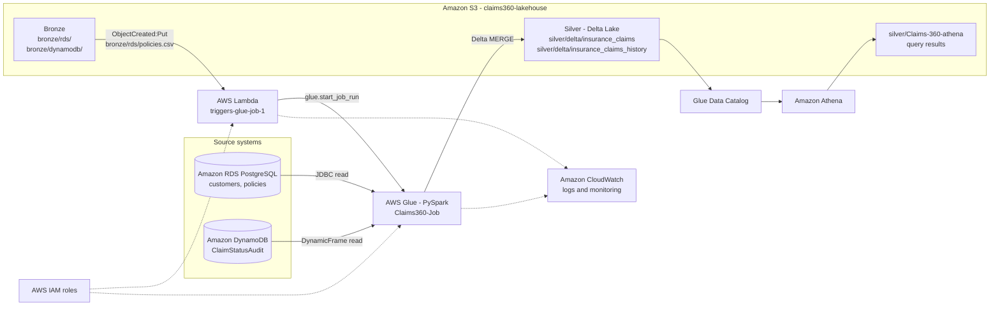

# Architecture Diagram

Only services demonstrated in the POC appear here. Future enhancements are intentionally excluded.

The Bronze files are the raw copies of the source data (uploaded to S3) and act as the batch-ready signal. The ETL code itself reads from RDS and DynamoDB directly.
