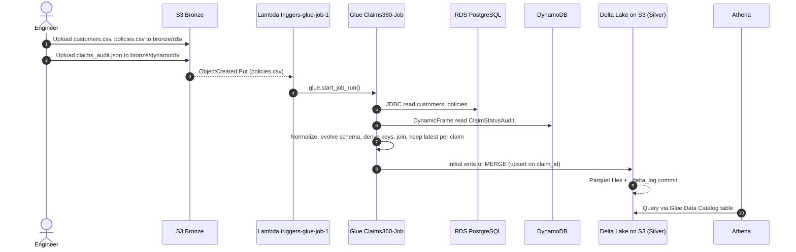
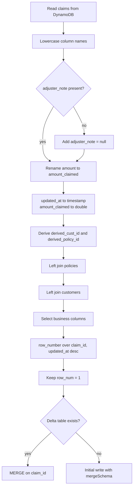

# Data Flow Diagram

End-to-end sequence for one pipeline run (steps follow the report).

```mermaid
sequenceDiagram
    autonumber
    actor Dev as Engineer
    participant S3 as S3 Bronze
    participant L as Lambda triggers-glue-job-1
    participant G as Glue Claims360-Job
    participant R as RDS PostgreSQL
    participant D as DynamoDB
    participant DL as Delta Lake on S3 (Silver)
    participant A as Athena

    Dev->>S3: Upload customers.csv, policies.csv to bronze/rds/
    Dev->>S3: Upload claims_audit.json to bronze/dynamodb/
    S3-->>L: ObjectCreated:Put (policies.csv)
    L->>G: glue.start_job_run()
    G->>R: JDBC read customers, policies
    G->>D: DynamicFrame read ClaimStatusAudit
    G->>G: Normalize, evolve schema, derive keys, join, keep latest per claim
    G->>DL: Initial write or MERGE (upsert on claim_id)
    DL-->>DL: Parquet files + _delta_log commit
    A->>DL: Query via Glue Data Catalog table
```

## Transformation steps inside the Glue job

```mermaid
flowchart TD
    A["Read claims from DynamoDB"] --> B["Lowercase column names"]
    B --> C{"adjuster_note present?"}
    C -- "no" --> C1["Add adjuster_note = null"]
    C -- "yes" --> D
    C1 --> D["Rename amount to amount_claimed"]
    D --> E["updated_at to timestamp<br/>amount_claimed to double"]
    E --> F["Derive derived_cust_id and derived_policy_id"]
    F --> G["Left join policies"]
    G --> H["Left join customers"]
    H --> I["Select business columns"]
    I --> J["row_number over claim_id, updated_at desc"]
    J --> K["Keep row_num = 1"]
    K --> L{"Delta table exists?"}
    L -- "yes" --> M["MERGE on claim_id"]
    L -- "no" --> N["Initial write with mergeSchema"]
```
