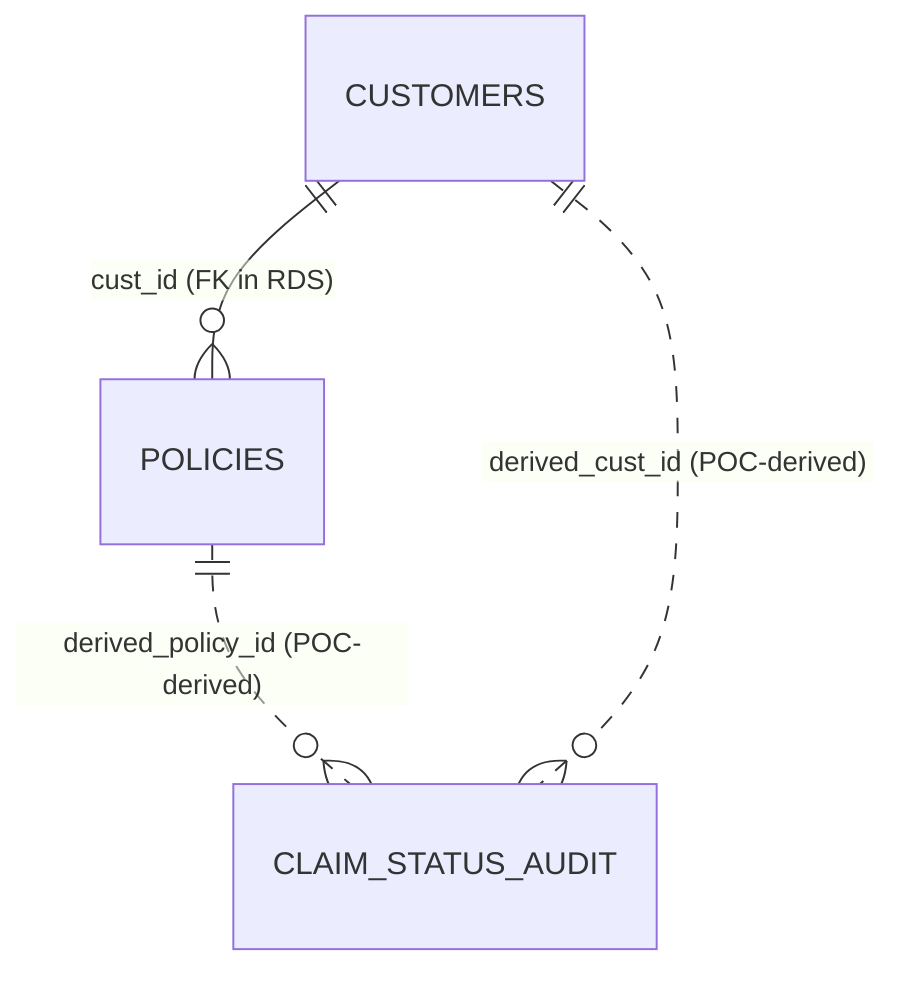

# Data Model

## Source tables

### `customers` (RDS PostgreSQL)

| Column | Type | Note |
|---|---|---|
| `cust_id` | INT, PK | |
| `name` | VARCHAR(100) | |
| `email` | VARCHAR(100) | |
| `risk_segment` | VARCHAR(20) | The CSV column is `risk` (Low / Med / High); it is loaded into `risk_segment` |

### `policies` (RDS PostgreSQL)

| Column | Type | Note |
|---|---|---|
| `policy_id` | VARCHAR(20), PK | e.g. `POL_101` |
| `cust_id` | INT, FK → customers | |
| `policy_type` | VARCHAR(50) | CSV column `type` (e.g. Auto) |
| `premium_amount` | INT | CSV column `premium` |

### `ClaimStatusAudit` (DynamoDB)

| Attribute | Type | Note |
|---|---|---|
| `claim_id` | String, partition key | e.g. `CLM_1000` |
| `updated_at` | String, sort key | ISO timestamp |
| `status` | String | Open / Under_Review / Paid |
| `amount` | Number | claim amount |
| `adjuster_note` | String | added later for the schema evolution demo |

## Relationships



Solid line = real foreign key in RDS. Dotted = relationship created inside the ETL.

## Derived keys (POC mechanism)

The audit records carry no `cust_id` or `policy_id`. Because the data is synthetic, the ETL derives them from the number in `claim_id`:

```text
n                 = numeric part of claim_id            (CLM_1005 -> 1005)
derived_cust_id   = n % 50 + 1                          -> 1..50
derived_policy_id = "POL_" + (n % 50 + 1 + 100)         -> POL_101..POL_150
```

This matches the generator (50 customers, policies `POL_101`–`POL_150`). It exists only so the three datasets can be joined in the demo. It is **not** a real-world insurance modeling practice; in a real system claims would carry a policy reference from the source.

## Silver table: `insurance_claims` (Athena schema shown in the report)

| Column | Type |
|---|---|
| `claim_id` | string |
| `updated_at` | timestamp |
| `status` | string |
| `amount` | double |
| `cust_id` | int |
| `policy_id` | string |
| `policy_type` | string |
| `premium_amount` | decimal(10,2) |
| `customer_name` | string |
| `risk_segment` | string |
| `adjuster_note` | string |

Grain: one row per `claim_id`, the latest audit entry. Full history is kept in `insurance_claims_history`.
